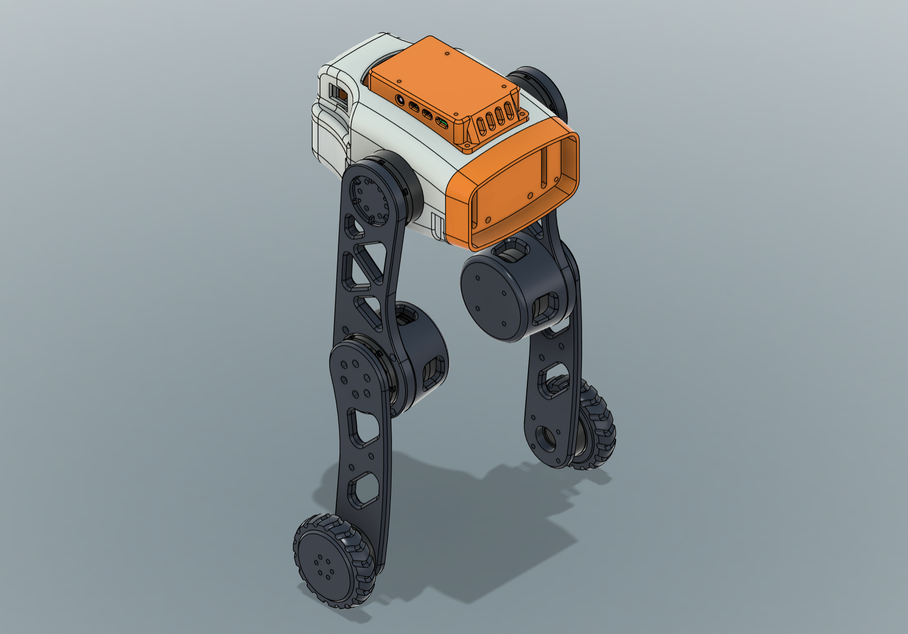

# Tancho - 6-DOF Wheel-Legged Robot

Tancho 是一個 6 自由度（6-DOF）雙輪腿機器人專案。本專案包含 CAD 機構設計模型、3D 列印檔，以及基於 NVIDIA Isaac Lab 與 RSL_RL 進行強化學習（RL）訓練的仿真環境。



---


## 📂 目錄結構 (Directory Structure)

```text
Tancho/
├── Tancho_v2/              # V2 URDF 與 Mesh 模型資源檔
├── Tancho_v2_simready/     # Isaac Lab 一鍵部署訓練環境與套件
├── Print.3mf               # 3D 列印切片設定檔 (Bambu Studio)
├── Tancho.step             # 完整 STEP 模型
├── Tancho_simplified.step  # 簡化版 STEP 模型 (用於轉換 URDF)
└── README.md               # 專案說明文件
```

`Tancho_v2/` 僅包含機器人 URDF 與 Mesh 模型資源；`Tancho_v2_simready/` 是可安裝、驗證、訓練與 Play 的 Isaac Lab 工程。

---

## 訓練與模擬 (Training and Simulation)

訓練專案位於 [`Tancho_v2_simready/`](./Tancho_v2_simready/)。

- [中文安裝、環境驗證與訓練指南](./Tancho_v2_simready/README.zh.md)
- [English installation, validation, and training guide](./Tancho_v2_simready/README.en.md)

---

## 版本演進 (Version History)

### V1 - 首次導出 (Initial Export)
* 完成基本 3D CAD 模型建立與 URDF 首次導出。
* 包含各剛體（Links）與關節（Joints）的初始幾何資訊。

### V2 - 模型精確化與 RL 環境架設 (Current)
* 修復 V1 導出時 Mesh 不精確、質量慣量與幾何中心偏差問題。
* URDF 頂層加入 Dummy Root Link 並修正 X 軸旋轉與生成撞地問題。
* 採用 Isaac Lab `ManagerBasedRLEnv` 寫法，於 `tancho_v2_env_cfg.py` 配置完整的 MDP 框架。
