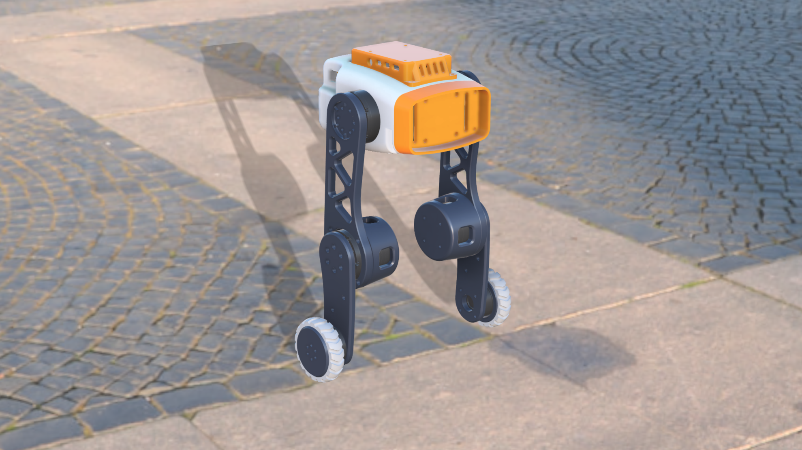

# Tancho - 6-DOF Wheel-Legged Robot

Tancho 是一個 6 自由度（6-DOF）雙輪腿機器人專案。本專案包含 CAD 機構設計模型、3D 列印檔，以及基於 NVIDIA Isaac Lab 與 RSL-RL 進行強化學習（RL）訓練的仿真環境。



---


## 📂 目錄結構 (Directory Structure)

```text
Tancho/
├── Tancho_v3/              # V3 URDF、Mesh、質量資料與資產工具
├── Tancho_v3_simready/     # Isaac Lab 一鍵部署訓練環境與套件
├── docs/                   # README 圖片與專案文件資源
├── Print.3mf               # 3D 列印切片設定檔 (Bambu Studio)
├── Tancho.step             # 完整 STEP 模型
├── Tancho_simplified.step  # 簡化版 STEP 模型 (用於轉換 URDF)
└── README.md               # 專案說明文件
```

`Tancho_v3/` 包含機器人 URDF、Mesh、質量資料，以及資產轉換與驗證工具；`Tancho_v3_simready/` 是可安裝、驗證、訓練與 Play 的 Isaac Lab 工程。

---

## 訓練與模擬 (Training and Simulation)

訓練專案位於 [`Tancho_v3_simready/`](./Tancho_v3_simready/)。

- [中文安裝、環境驗證與訓練指南](./Tancho_v3_simready/README.zh.md)
- [English installation, validation, and training guide](./Tancho_v3_simready/README.en.md)

---

## 版本演進 (Version History)

### V1 - 首次導出 (Initial Export)

- 完成基本 3D CAD 模型建立與 URDF 首次導出。
- 建立各剛體（Links）、關節（Joints）與基礎幾何結構。

### V2 - 模型精確化與 RL 環境建立


- 修復 V1 Mesh 精度、質量、慣量與幾何中心偏差。
- 在 URDF 頂層加入 Dummy Root Link，修正匯入 Isaac Sim 時的座標軸旋轉與初始穿地問題。
- 建立基於 Isaac Lab `ManagerBasedRLEnv` 的強化學習環境。
- 完成機器人動作、觀測、獎勵、終止條件與初始站姿等基礎 MDP 配置。
- 整合 RSL-RL 訓練與 Play 流程，作為後續版本的仿真基礎。

### V3 - 腿部改版與 SimReady 工程化

- 更新腿部機構尺寸，thigh 與 calf 長度分別調整為 15 cm 與 10 cm，並同步更新 URDF 與 STL。
- 新增 IMU Link，配置於 `base_link` 中心下方約 30 mm 處。
- 以共用 MDP 為基礎，將 Flat、Rough、Terrain 與自訂 Reward 依環境職責拆分。
- 加入初始站姿掃描與輪子 PD 診斷工具。
- 建立 MCP 介面，讓 AI agent 能執行環境驗證、診斷、訓練與 Play。
